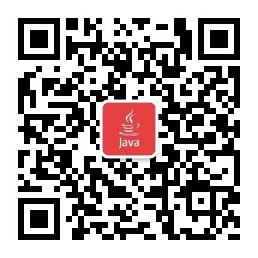

# 学生宿舍管理系统 

##（源代码+12000字文档+ppt）

## 项目简介
学生宿舍管理系统是一套基于SpringBoot的前后端分离的管理系统，分为宿舍管理员和学生两个角色。 
物业管理人员可以对学院、专业、学生、宿舍进行管理，处理学生的维修工单和宿舍调换申请，发送通知公告，并且可以对缺勤的学生和来访人员进行管理。 
学生可以选择自己的宿舍、申请调换宿舍、对损坏的家具进行报修、查看管理员发布的公告。 
前端使用Vue框架，后端使用SpringBoot框架，数据库使用的是Mysql。 
本系统功能完善，涉及的技术比较广，难度适中，都是市面上主流的技术，非常适合作为设计项目或开发学习。 
视频介绍：<a href="https://www.bilibili.com/video/BV15u41137Ta/?spm_id_from=333.999.0.0" target="_blank">点击查看B站视频介绍</a>

## 功能介绍

## 技术学习

如果你在安装过程中，或对项目有疑问，可以关注本人公众号获取本人联系方式进行咨询。 
公众号内还有更多项目供你选择。 

## 技术服务

## 技术栈

| 工具及技术             | 版本    |
| ---------------------- | ------- |
| idea                   |         |
| JDK                    | 1.8     |
| SpringBoot             | 2.2.1   |
| MyBatis                | 1.3.2   |
| JWT                    | 3.4     |
| Vue                    | 2.0     |
| ElementUI              | 2.0     |
| MySQL                  | 5.7     |
| Node                   | v16.16.0|

## 系统图片

#### 1.登录页
 
#### 2.首页
 
#### 3.学院管理
 
#### 4.学生管理
 
#### 5.宿舍管理
 
#### 6.缺勤管理
 
#### 7.出入登记
 
#### 8.学生选择宿舍
 
#### 9.学生调换宿舍
 
#### 10.学生报修
 
#### 11.学生查看公告
 
